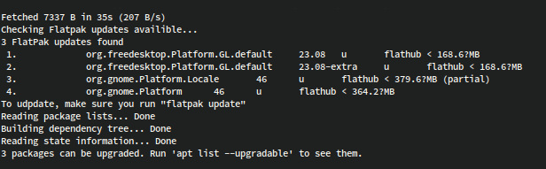

# Flatpak APT Integration

A simple Bash script that integrates Flatpak update checks with the `apt update` command on Debian-based systems. This script runs as an APT hook to notify of available Flatpak updates whenever you run `sudo apt update`.


## Features

- Automatically checks for Flatpak updates during `apt update`.
- Displays the number of available Flatpak updates and their details.

## Requirements

- A Debian-based Linux distribution (e.g., Ubuntu, Debian).
- `apt` and `flatpak` installed on your system.

## Installation

1. **Obtain the script**:
   - Clone the repository:
     ```bash
     git clone https://github.com/why-try313/flatpak-apt-integration.git
     ```
   - Or download the `flatpak-checker.sh` script directly from the [repository](https://github.com/why-try313/flatpak-apt-integration).
   - Alternatively, create a new file named `flatpak-checker.sh` and paste the following code:
	   <details>
	        <summary>flatpak-checker.sh</summary>
	
	     ```bash
	     #!/bin/bash
	
	     # Hook installation:
	     # file: /etc/apt/apt.conf.d/05flatpak-hook 
	     # contents: APT::Update::Post-Invoke {"/my/path/to/this/file/flatpak-checker.sh"};
	
	     echo "Checking Flatpak updates available..."
	     USR="$USER" # Switch back to current user instead of sudo:root
	     if [ $USER = "root" ]; then USR="$SUDO_USER"; fi
	
	     # Get updates
	     UPDATES=$(sudo -u "$USR" flatpak update --appstream 'n\n' 2>/dev/null | grep -Eo "^[\ ]*[0-9]+\..*" --color=none)
	     UPDATES_NB=$(echo "$UPDATES" | sed -z '$ s/\n$//' | wc -l)
	
	     if [ $UPDATES_NB = "0" ]; then
	         echo "Flatpak: No Updates found, skipping..."
	         exit
	     fi
	
	     echo "[i] $UPDATES_NB FlatPak updates found"
	     echo "$UPDATES"
	     echo '[i] To update, make sure you run "flatpak update"'
	     ```
	   </details>

2. **Make the script executable**:
   ```bash
   chmod +x /path/to/flatpak-checker.sh
   ```

3. **Create the APT hook**:
   - Create a file named `/etc/apt/apt.conf.d/05flatpak-hook`:
     ```bash
     sudo nano /etc/apt/apt.conf.d/05flatpak-hook
     ```
   - Add the following line, replacing `/my/path/to/this/file/flatpak-checker.sh` with the actual path to your `flatpak-checker.sh`:
     ```
     APT::Update::Post-Invoke {"/my/path/to/this/file/flatpak-checker.sh"};
     ```
   - Save and exit the editor.

4. **Verify the setup**:
   Ensure the hook file and script are correctly set up by running:
   ```bash
   sudo apt update
   ```

## Usage

Run the following command to check for both APT and Flatpak updates:
```bash
sudo apt update
```

The script will:
- Check for available Flatpak updates.
- Display the number of updates found and their details (if any).
- Prompt you to run `flatpak update` to apply the updates.

To apply Flatpak updates, run:
```bash
flatpak update
```

